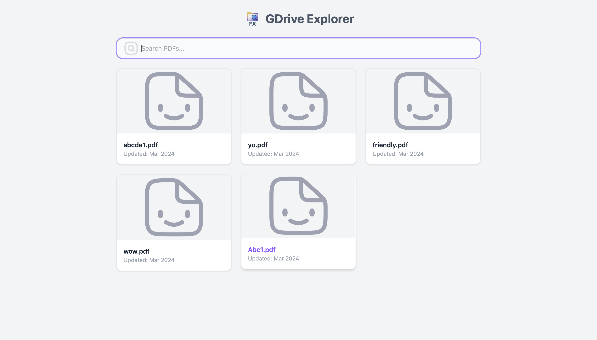
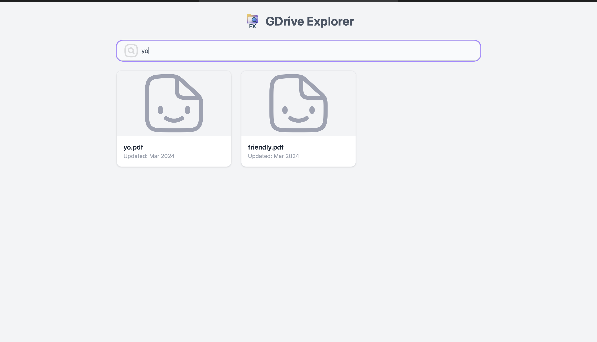
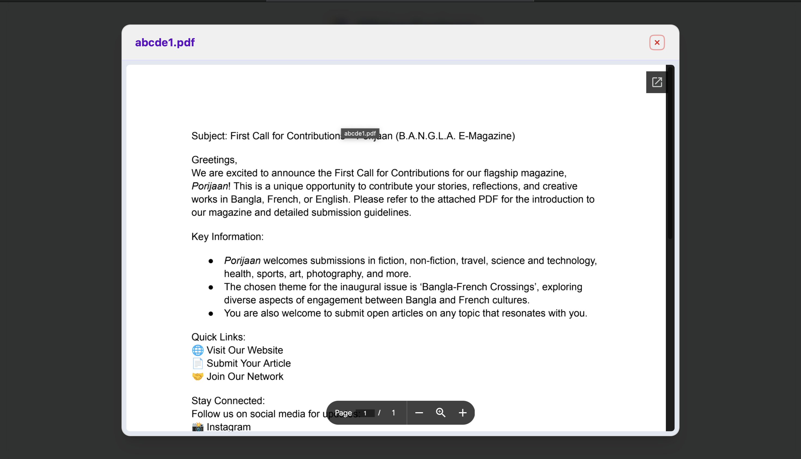

# 📂 Google Drive File Explorer

A lightweight React + TypeScript + Vite application that lets you view publicly shared PDF files from a Google Drive folder. Features include:

- File preview modal
- Search with fuzzy matching
- Clean UI with Tailwind CSS
- Google Drive API integration (API key only, no OAuth)

---

## 🚀 Demo

> Coming soon or deploy on [Vercel](https://vercel.com/) or [Netlify](https://netlify.com/)

---

## 📁 Features

- ✅ Fetches files from a public Google Drive folder
- ✅ Renders file cards with name, updated date, and static preview
- ✅ Modal viewer for file preview
- ✅ Search bar with fuzzy match
- ✅ Responsive layout with TailwindCSS

---

## 🛠 Setup Instructions

### 1. Clone the Repository

```bash
git clone https://github.com/Iktisad/gdrive-explorer.git
cd gdrive-explorer
```

### 2. Install Dependencies

```bash
npm install
```

### 3. Set Up Environment Variables

Create a `.env` file in the root of the project:

```env
VITE_API_KEY=your_google_drive_api_key
VITE_GOOGLE_DRIVE_FOLDER_ID=your_folder_id
```

### 4. Run the Dev Server

```bash
npm run dev
```

Visit [http://localhost:5173](http://localhost:5173) to view the app.

---

## 📦 Build for Production

```bash
npm run build
npm run preview
```

---

## 📸 Screenshots

<div style="display: flex; gap: 10px; flex-wrap: wrap;">
  
  
  
</div>

## 🧩 Tech Stack

- [React](https://reactjs.org/)
- [Vite](https://vitejs.dev/)
- [Tailwind CSS](https://tailwindcss.com/)
- Google Drive API (API key only)

---

## 📄 License

MIT License
